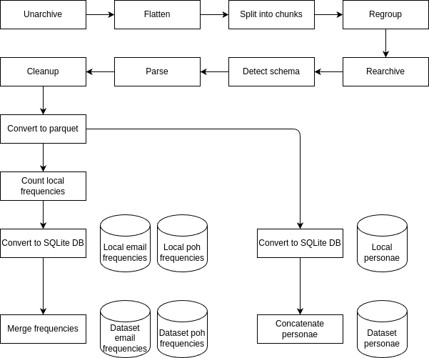

# MrCombolist

> Once you walk off the paved leafy avenue and step into a back alley of the Internet, you'll find yourself in shambles.
> But I find joy in collecting some craps out there, polishing them at home, and then decorating my petty shelf with them.

## Overview

This repo is for the scripts to work with combolists and (maybe) for analysis results obtained from them.
It's subject to frequent change, and I don't have any plans to get it production-ready.
This is just a hobby project for my free time. :-)

### Operation flow

### Terminology

#### PoH

PoH stands for "Password or Hash".
Combolists contain hashed passwords as well as plaintext ones.

#### Persona

Persona (pl. personae) is a set of data related to an email address.
Currently, it is a set of email address and poh.
I've started to use this term out of a whim, so it may be changed in case any better wordage is found.
